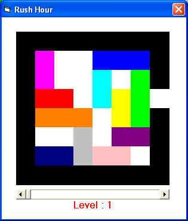

## Rush Hour \!

### Description

Rush Hour is a logical game ... a nice ones, that's all !!!

The purpose of the game is to bring out the Red Tile,

You are able to move each Tile in straight line.

The game has 40 standard levels.

... Enjoy ...

Mahdi Shakouri Rad  Mahdi.ShakouriRad@gmail.com Mahdi_Rad@yahoo.com

ps. I've uploaded in www.planetSourceCOde.com another user-friendly of this game

named "Rush Hour", check it too :-)
 
### More Info
 

             |
---                |---
**Submitted On**   |2005-06-19 15:08:02
**By**             |[Mahdi Shakouri Rad](https://github.com/Planet-Source-Code/PSCIndex/blob/master/ByAuthor/mahdi-shakouri-rad.md)
**Level**          |Beginner
**User Rating**    |5.0 (10 globes from 2 users)
**Compatibility**  |VB 6\.0
**Category**       |[Games](https://github.com/Planet-Source-Code/PSCIndex/blob/master/ByCategory/games__1-38.md)
**World**          |[Visual Basic](https://github.com/Planet-Source-Code/PSCIndex/blob/master/ByWorld/visual-basic.md)
**Archive File**   |[Rush\_Hour\_1903686202005\.zip](https://github.com/Planet-Source-Code/mahdi-shakouri-rad-rush-hour__1-61250/archive/master.zip)

